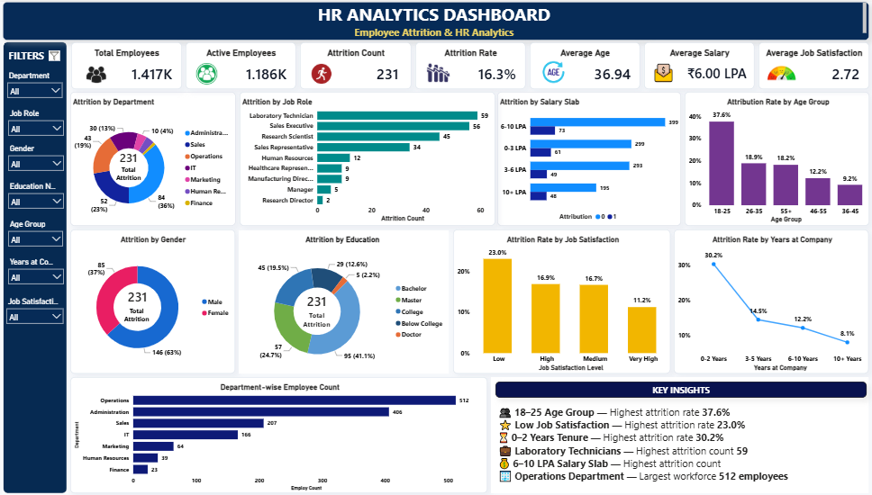

# 📊 HR Analytics Dashboard | Power BI

## 📌 Project Overview

The **HR Analytics Dashboard** is an interactive Business Intelligence dashboard developed using **Microsoft Power BI** to analyze employee workforce, attrition, salary, job satisfaction, demographics, and tenure.

The dashboard provides HR teams and business stakeholders with a clear view of workforce trends and key attrition drivers, helping support **data-driven workforce and employee retention decisions**.

---

## 🎯 Business Objective

The primary objective of this project is to analyze employee attrition and workforce patterns across multiple dimensions, including:

* Employee demographics
* Department and job role
* Salary slabs
* Education
* Job satisfaction
* Age groups
* Years at company

The dashboard converts HR data into **interactive KPIs, visualizations, and actionable insights**.

---

## 🛠️ Tools & Technologies

* **Microsoft Power BI**
* **Power Query** – Data cleaning and transformation
* **DAX** – Measures and KPI calculations
* **Data Visualization**
* **Business Intelligence**
* **HR Analytics**

---

## 📊 Dashboard KPIs

| KPI                      |     Value |
| ------------------------ | --------: |
| Total Employees          |    1.417K |
| Active Employees         |    1.186K |
| Attrition Count          |       231 |
| Attrition Rate           |     16.3% |
| Average Age              |     36.94 |
| Average Salary           | ₹6.00 LPA |
| Average Job Satisfaction |      2.72 |

---

## 📈 Dashboard Analysis

The dashboard provides analysis across the following areas:

### Workforce Analysis

* Total and active employee overview
* Department-wise employee distribution
* Employee distribution across different job roles

### Attrition Analysis

* Attrition by department
* Attrition by job role
* Attrition by gender
* Attrition by education
* Attrition by salary slab

### Employee Demographics

* Attrition rate by age group
* Attrition rate by years at company
* Education-wise attrition analysis

### Employee Satisfaction

* Attrition rate by job satisfaction level
* Identification of employee groups with higher attrition

---

## 🔍 Key Insights

* **18–25 age group** records the highest attrition rate at **37.6%**.
* Employees with **low job satisfaction** have the highest attrition rate at **23.0%**.
* Employees with **0–2 years of tenure** show the highest attrition rate at **30.2%**.
* **Laboratory Technicians** have the highest attrition count at **59**.
* The **6–10 LPA salary slab** records the highest attrition count.
* **Operations** has the largest workforce with **512 employees**.

---

## 💡 Business Value

This dashboard can help HR teams:

* Identify employee groups with higher attrition risk
* Understand key workforce and retention patterns
* Compare attrition across departments and job roles
* Analyze the relationship between salary, satisfaction, tenure, and attrition
* Monitor workforce composition and employee trends
* Support data-driven HR planning and retention strategies

---

## 📷 Dashboard Preview

---

## 🚀 Project Highlights

* Interactive HR analytics dashboard
* KPI-driven workforce overview
* Multi-dimensional attrition analysis
* Interactive filters and slicers
* Business-focused visualizations
* Actionable HR insights
* Professional Power BI dashboard design

---

## 👨‍💻 Author

**Gaurav Sahu**

Data Analyst | Power BI | SQL | Python | Excel

---

⭐ If you find this project useful, feel free to explore the repository and connect with me.
